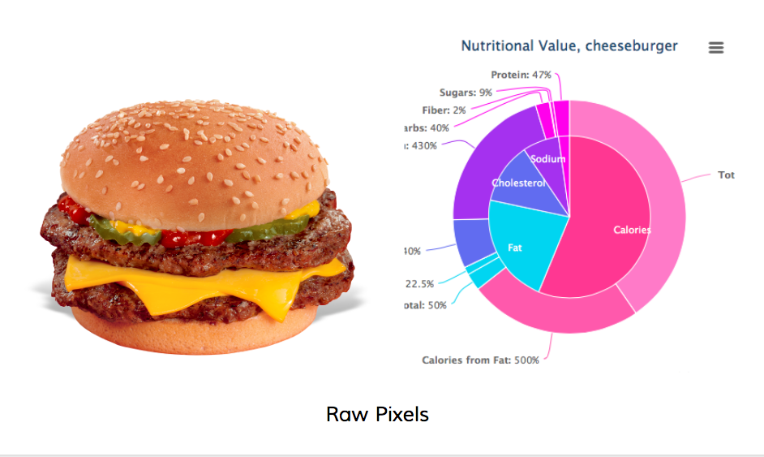

=======
raw-pixels
==========

Visualizing nutrition facts, a project started at #code4health. This is built with the Haskell [SnapFramework](http://snapframework.com).



#Installation

Install GHC from [haskell.org/platform](http://haskell.org/platform). It should be the latest. At the time of this writing the latest version is GHC 7.6.3. It comes with cabal, which is a package manager that helps you install packages from [hackage](http://hackage.haskell.org).

The .cabal file lists dependencies.


#Usage

1. Sign up for API accounts at [Instagram](http://api.instagram.com), [Jawbone Up](http://developer.jawbone.com), and [FatSecret](http://platform.fatsecret.com/api/).
2. Create a configuration file that lists the api secret keys.
3. Build and run server

```sh
$ cabal build
$ dist/build/codeforhealth/codeforhealth
```

**Developer Note:** if you will be editing files, use the fswatch library. The command to watch for changes isi shown below. Template places are saved in snaplets/heist/templates directory and media files saved in static.

```sh
$ fswatch snaplets/heist/templates:static "curl http://localhost:8000/heistReload"
```


#Links
There are some javascript charting libraries available for visualizing nutrient data.

* [Nutrient Contents](http://exposedata.com/parallel/)
* [Nutrient Explorer](http://bl.ocks.org/syntagmatic/raw/5023284/) 
